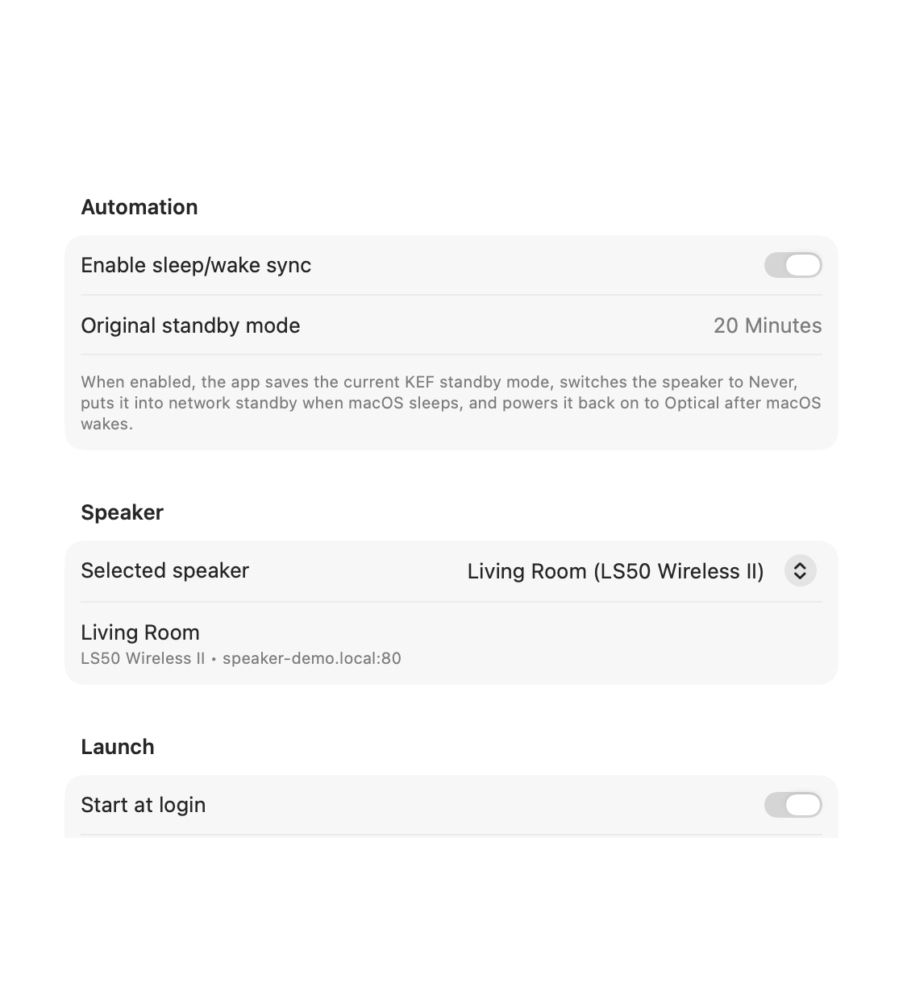
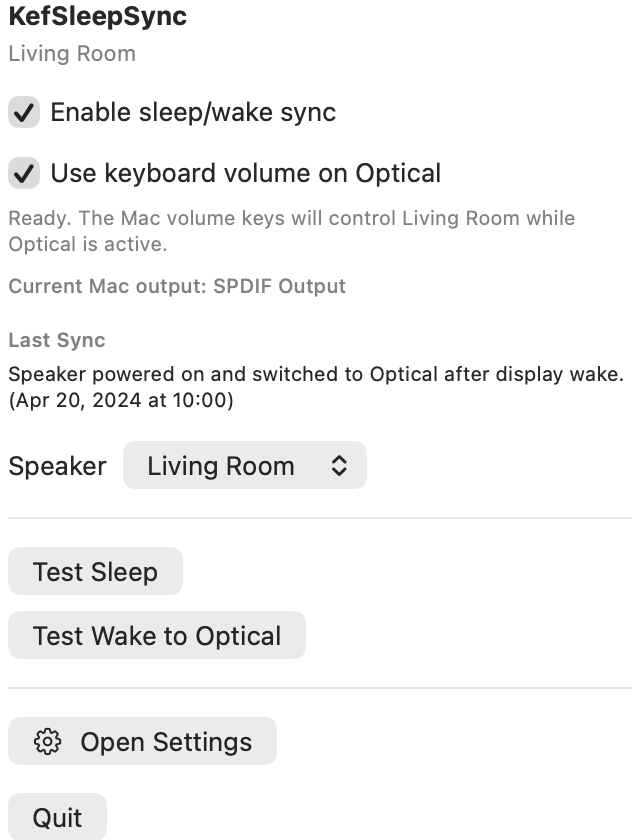

# KefSleepSync

[](https://github.com/tkelkermans/KefSleepSync/actions/workflows/ci.yml)
[](https://github.com/tkelkermans/KefSleepSync/releases)
[](https://support.apple.com/macos)
[](./LICENSE)

KefSleepSync is a native macOS menu bar app for KEF LS50 Wireless II speakers. It keeps the speaker aligned with the Mac's real-world desktop state, especially the case where the Mac is locked and the display turns off even though the whole machine may not enter full system sleep.

It can also take over the Mac's hardware volume keys while the selected KEF speaker is using Optical, letting the keyboard adjust the speaker volume through KEF's local API instead of macOS's normal digital output volume. That keyboard override is now route-aware: it only activates while macOS is actually outputting to the learned Optical device, and it automatically falls back to normal macOS volume control when the Mac switches to speakers, AirPods, or another output.

The app uses only Apple frameworks:

- `SwiftUI`
- `Network`
- `URLSession`
- `ServiceManagement`
- `AppKit` / `NSWorkspace`
- `IOKit`

No third-party frameworks are required.

## Screenshots

### Settings



### Menu bar



## Why this exists

KEF speakers can either stay awake and get warm, or rely on their own standby behavior, which does not always line up cleanly with how a Mac wakes, locks, sleeps, or hands audio back to Optical.

KefSleepSync moves that logic to macOS instead:

- when the Mac becomes inactive, locks, blanks the display, or sleeps, the app puts the speaker into standby
- when the Mac becomes active again, wakes the display, or wakes the system, the app wakes the speaker and switches it back to Optical

## What's new in v0.2.0

- Added native keyboard volume control for KEF when using Optical.
- Added route-aware keyboard interception so AirPods, Mac Speakers, and other macOS outputs keep their normal volume-key behavior.
- Added Core Audio monitoring of the current macOS output route and surfaced that state in the menu bar and Settings UI.
- Added test coverage for media-key parsing, KEF volume payloads, and optical route matching.

## What the app does

- Discovers KEF speakers on the local network via Bonjour using `_kef-info._tcp`
- Remembers the selected speaker by KEF identity so speaker IP changes do not break the setup
- Runs as a menu bar app with no Dock icon
- Lets you enable or disable automation from the menu bar or Settings window
- Optionally captures the Mac volume keys and maps them to KEF volume changes while Optical is active on both the KEF speaker and the current macOS audio route
- Can register itself as a login item when installed in `/Applications`

When automation is enabled, the app:

1. Reads and saves the current KEF standby mode.
2. Sets the KEF standby mode to `Never` so the speaker's own timer does not fight the Mac-driven behavior.
3. Watches for:
   - screen lock / unlock
   - display sleep / wake
   - macOS session active / inactive changes
   - full system sleep / wake via both `NSWorkspace` and IOKit power notifications
4. On a sleep-like event, sends the speaker to standby.
5. On a wake-like event, waits for the speaker to become reachable again, switches it back to Optical, and verifies the source when possible.
6. When automation is disabled, restores the original KEF standby mode.

## Keyboard volume behavior

When `Use Mac volume keys for KEF` is enabled, the app checks two things before it swallows a volume-key press:

1. The selected KEF speaker is currently on `Optical`.
2. macOS is currently sending audio to the learned Optical output route.

The first time you enable the feature, switch macOS audio output to your Optical device once so the app can learn it. After that:

- If macOS output is your Optical device, volume up and volume down control `player:volume` on the KEF speaker.
- If macOS output is `Mac Speakers`, `AirPods`, or another route, KefSleepSync lets the key press pass through to macOS normally.
- The current macOS output route is shown in both the menu bar popover and the Settings window.

This feature still requires:

- macOS Input Monitoring permission, so the app can capture the hardware volume keys
- the selected KEF speaker to be reachable on the local network

## KEF API behavior

KefSleepSync talks to the speaker's local NSDK HTTP API directly.

It currently uses:

- `GET /api/getData`
- `POST /api/setData`

It reads and writes values such as:

- `settings:/kef/host/standbyMode`
- `settings:/kef/play/physicalSource`
- `player:volume`
- `settings:/webserver/authMode`

For speakers that require authenticated local writes, the app includes the KEF-compatible local HMAC/AES request signing flow used by the speaker's local web interface.

## Requirements

- macOS 14 or later
- A KEF speaker that exposes the local NSDK HTTP API
- The Mac and speaker on the same local network
- Local Network permission granted to the app on first launch

## Current limitations

- The app currently targets one primary KEF speaker.
- It was built around KEF LS50 Wireless II behavior and has not been broadly tested across all KEF models.
- There is no UI yet for entering a KEF web password. If the speaker is configured with a non-empty web password, more UI work is needed.
- The app is focused on lock, display sleep, session activity, and full sleep/wake transitions. It does not attempt to infer every possible idle state outside those system signals.
- Keyboard volume control currently handles only volume up and volume down. Mute is not wired yet.
- Keyboard volume control relies on macOS Input Monitoring permission to capture the hardware volume keys.
- The learned Optical route is based on the current macOS default output device name, manufacturer, and optional data-source name. If your audio hardware naming changes significantly, re-enabling the feature may be the fastest way to re-learn the route.

## Project layout

- [App](./App): app entry point and app delegate
- [Models](./Models): domain models and NSDK payload types
- [Services](./Services): KEF API client, request security, discovery, login item support, media-key capture, and macOS audio-route monitoring
- [Stores](./Stores): shared app state and power-sync orchestration
- [Support](./Support): unified logging helpers
- [Views](./Views): menu bar UI and Settings window UI
- [Tests](./Tests): unit tests for NSDK decoding/encoding, KEF request signing, media-key parsing, and optical-route matching
- [script](./script): build/run helper and app icon generator

## Build in Xcode

1. Open [KefSleepSync.xcodeproj](./KefSleepSync.xcodeproj).
2. Select the `KefSleepSync` scheme.
3. Build and run on `My Mac`.
4. On first launch, allow Local Network access when macOS prompts for it.

## Build from the terminal

```bash
xcodebuild \
  -project KefSleepSync.xcodeproj \
  -scheme KefSleepSync \
  -configuration Debug \
  -destination 'platform=macOS'
```

## Run from the terminal

The repo includes a helper script that kills the previous app, rebuilds, and launches the fresh one:

```bash
./script/build_and_run.sh
```

Useful variants:

- `./script/build_and_run.sh --verify`
- `./script/build_and_run.sh --logs`
- `./script/build_and_run.sh --telemetry`
- `./script/build_and_run.sh --debug`

## Test

```bash
xcodebuild test \
  -project KefSleepSync.xcodeproj \
  -scheme KefSleepSync \
  -configuration Debug \
  -destination 'platform=macOS,arch=arm64'
```

## Install for daily use

For the most reliable login-item behavior:

1. Build the app.
2. Copy `KefSleepSync.app` into `/Applications`.
3. Launch it from `/Applications`.
4. Enable `Start at login` inside the app if desired.

Because it is a menu bar app, you should look for the speaker icon in the macOS menu bar rather than in the Dock.

## Development notes

- The app uses unified logging through `OSLog`.
- The main runtime coordinator lives in [Stores/AppModel.swift](./Stores/AppModel.swift).
- Discovery is based on Bonjour resolution, not hardcoded speaker IPs.
- README screenshots can be regenerated with `./script/generate_readme_screenshots.sh`.
- The repository ignores local build products, xcresult bundles, Codex workspace config, and scratch icon exports by default.

## License

This project is licensed under the [0BSD license](./LICENSE), a very permissive no-attribution license.
